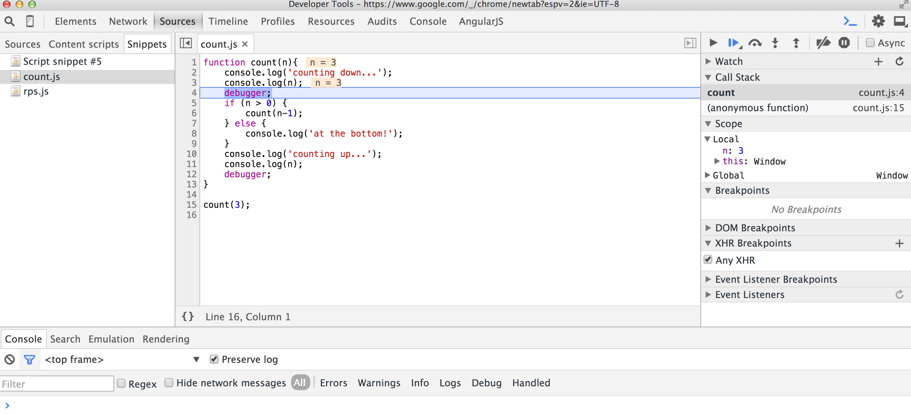

# Debugging JavaScript

## Error messages

Sometimes error messages are awesome. Sometimes not so much.  Be aware that in the chrome dev tools console, the right hand side of an error line often shows you the file name and line number that the error came from.

  

_The error source above was script.js, line 18._

## `console.log()`

Tips for console logging:

* Write descriptive log messages.
* Don't reuse the same log message in multiple places; it will be hard to tell where messages came from.
* Use a comma instead of a plus sign to add an object to a log message that is a string.

```js
//BAD
console.log("test " + this);
//GOOD
console.log("inside add button click event - this is ", this);
```

## `debugger` 

`debugger` is a JavaScript tool for debugging! It lets you pause your code on a specific line, wherever you write the keyword `debugger`. While it's paused, you can examine the scope, the call stack, and other useful information.  Across many languages and tools, interactive pauses like this are called "breakpoints".


### Chrome Dev Tools

Chrome's "Sources" tab provides a nice Graphical User Interface, or GUI (pronounced "gooey") for the debugger tool. 


> 

Here's an example you can use to explore recursion with `debugger`:

```js
	function count(n){
	    console.log('counting down...');
	    console.log(n);
	    debugger;
	    if (n > 0) {
	        count(n-1);
	    } else {
	        console.log('at the bottom!');
	    }
	    console.log('counting up...');
	    console.log(n);
	    debugger;
	}

count(3);
```

If you'd like your dev tools in a separate window from your browser, click and hold the dev tools positioning icon to undock them.  


### Node.js

Since Node.js is built on the same JavaScript engine Chrome uses (called "V8"), we can also use `debugger` when running a file from the terminal with Node.js:

```bash
node debug script.js
```

You don't have a GUI in the Terminal, so you'll have to enter debugger text commands. A full list of commands and more information on how to use `debugger` with Node.js is avaiable in the <a href="https://nodejs.org/api/debugger.html" target="_blank">Node.js debugger documentation</a>.

## Conditional Breakpoints in Chrome Dev Tools

Chrome dev tools also lets you set "conditional breakpoints" that pause whenever some trigger occurs, like "pause whenever a click event fires" or "pause whenever a request is made". You set these through the Sources tab, in the breakpoint dropdowns.  More details (and images!) are available in Google's <a href="https://developers.google.com/web/tools/javascript/breakpoints/add-breakpoints?hl=en#create-conditional-breakpoints" target="_blank">how to add breakpoints</a>.

## More Resources

* Google's <a href="https://developers.google.com/web/tools/javascript/index?hl=en" target="_blank">guide to debugging JavaScript with Chrome Dev Tools</a>


## Drills!

The code in script.js has comments that list some problems with the sample project website. There are currently some bugs, but it should look like this:


Update the project code to fix the problems described in the comments. Note: the last one (alerting) is a stretch.
